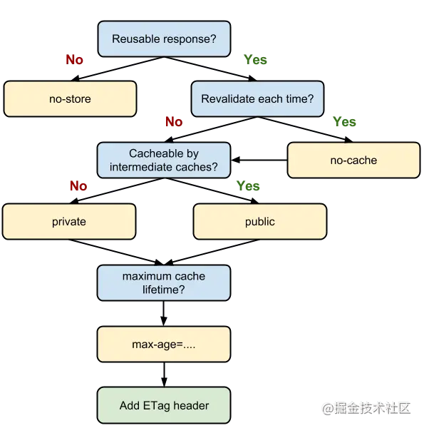
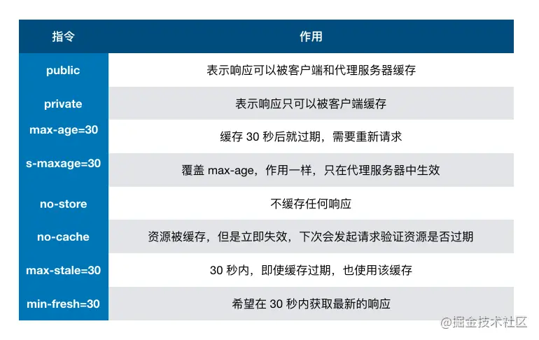

## 浏览器缓存策略

### 缓存过程

#### 强缓存

浏览器从请求的 `Response Header` 中找 `expires`  `pragma`  `cache-control` 字段，如果有代表需要强缓存资源，将资源存储到 `Memory Cache` 或 `Disk Cache` 。一般情况下js, css, 图片等都会加上hash并进行强缓存。

##### Expires: `<http-date>` (GMT格林威治时间)  

`http1.0` 响应头，如： `Expires: Wed, 21 Oct 2015 07:28:00 GMT ` 表示在这个时间之后资源过期，如果在 `cache-control` 设置了 `max-age` 或 `s-max-age` 则忽略 `expires` 。

##### pragma: no-cache  

`http1.0` 响应头，表示防止客户端缓存资源，强制从服务端获取，与 `Cache-Control: no-cache` 效果一直。

##### cache-control: max-age=31536000  
  
  

`http1.1` 响应头， 客户端和服务器的指令有区别。

* `max-age=<seconds>` 值为相对于请求的时间
* `no-cache` (同max-age=0)可以缓存，但必须重新验证有效性，可以跳过http响应体的下载
* `no-store` 不缓存
* `only-if-cached` 只接受缓存，并不向服务端验证

#### 协商缓存

一般html会进行协商缓存。

1. `last-modified & if-modified-since`

last-modified: Thu, 15 Apr 2021 10:57:40 GMT  
如果初次请求的响应头携带了，则下次会将值作为 `if-modified-since` 传给服务端

2. `etag & If-None-Match` 优先级高于`last-modified`

etag: "26E957E2F9E06CA9748784EECEA9AC58" 
如果初次请求的响应头携带了，下次请求作为 `If-None-Match` 传给服务端

### 缓存位置

一般来说图像等网页资源存储在 `disk cache` 而操作系统缓存文件在 `memory cache` ，实际浏览器会根据资源利用率进行自动分配

#### Service Worker（HTTPS）

涉及请求拦截，可操作性强，持续缓存

#### Memory Cache

内存读取快，持续性短

#### Disk Cache

读取慢，容量大，持续性强

#### Push Cache（HTTP2.0）

#### prefetch cache

标签携带 `prefetch` 属性时，会在浏览器空闲时进行加载
