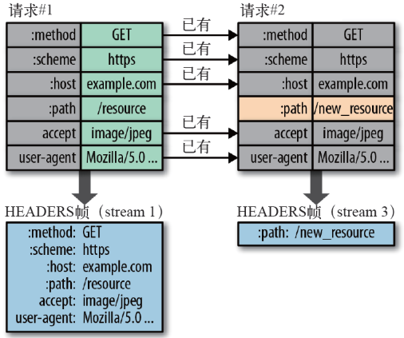

#### 题目：UDP 与 TCP 的区别是什么？

#### ORTT? HTTPS握手？

#### 参考链接
[关于Http协议，你必须要知道的](https://segmentfault.com/a/1190000016751071)  
[一文读懂 HTTP/2 及 HTTP/3 特性](https://blog.fundebug.com/2019/03/07/understand-http2-and-http3/)  
[解密HTTP/2与HTTP/3 的新特性](https://segmentfault.com/a/1190000020714686)  
[https到底是如何防篡改的？](https://juejin.cn/post/6845166890675863559)  
[https详细握手过程](https://juejin.cn/post/6847902219745181709#comment)

------
#### 网络通信

OSI模型：物理层、数据链路层、网络层、传输层(TCP/UDP)、会话层、表示层、应用层

### TCP 基于连接

头部：
1. Sequence number 序列号，保证报文有序，对端组装数据包使用
2. Acknowledgement Number 接收端希望收到的下一个字节序号，同时表示已收到上个序号的数据
3. Window Size 窗口大小，还能接收多少字节的数据，用于流量控制
4. 标识符
    - SYN
        - SYN=1，ACK=0，表示当前报文段是一个连接请求报文。
        - SYN=1，ACK=1，表示当前报文段是一个同意建立连接的应答报文。
    - ACK=1，表示确认序号字段有效，建立连接后所有报文的 ACK 都要置为1。
    - FIN=1，表示此报文段是一个释放连接的请求报文。
    - URG=1，表示数据包包含紧急信息属于高优先级数据报文，此时紧急指针有效，紧急数据位于数据部分最前面，紧急指针标明紧急数据的尾部。
    - PSH=1，表示接收端应该立即将数据 push 给应用层，而不是等到缓冲区满后再提交。
    - RST=1，表示当前连接出现问题，可能需要重新建立连接，也可以用于拒绝非法的报文段和拒绝连接请求。

::: details 三次握手
1. 客户端发送 `SYN` 包到服务端并进入 `SYN-SEND` 状态（第一次🤝）
2. 服务端同意连接则回复 `SYN+ACK` 包并进入 `SYN-RECEIVED` 状态（第二次🤝）
3. 客户端收到后回复 `ACK` 包并进入 `ESTABLISHED` 状态（第三次🤝）
4. 服务端收到后进入 `ESTABLISHED` 状态，建立连接

- 第三次握手的必要性？
    - 为了防止已失效的连接请求报文突然传送到服务端引起错误，解决网络信道不可靠的问题。
- 连接过程中任意端掉线 TCP 都会重发 SYN 包，一般会重试5次。
:::

::: details 传输确认
- 丢包问题 & 乱序问题
    - TCP协议为每一个连接建立了发送缓冲区（发送窗口），建立连接后的第一个字节序列号为0，后面每个字节的序列号+1，发送数据时从缓冲区取出一部分数据组成发送报文，在TCP协议头中会附带”序列号和长度“，接受端收到后回复的 ACK 包包含了接收的”序列号和长度“也就是下一包数据的起始序列号。
    - 接收端收到后根据”序列号和长度“重组数据包，如果有丢失可以重发一个 ACK 包到发送端要求发送端重发。
- ARQ 协议，超时重传机制 & 滑动窗口
    - 停止等待 ARQ（效率低，每次都需要等待）
        - 只要 A 向 B 发送一段报文，都要暂停发送并启动一个定时器，等待对端回应，在定时器时间内接收到对端应答就取消定时器并发送下一段报文。未接收到就重发丢失的数据到对端，传输过程中也可能出错那么对端也可以要求发送端重发报文。对端的应答报文也可能出现丢失或超时，发送端同样会重发报文，对端接收到的如果是相同序号的报文则直接丢弃并重发应答报文，直到接收到发送端的下一序号的报文。发送端同样的如果接受到已经收到过的应答报文就直接丢弃。
    - 连续 ARQ
        - 发送端拥有一个发送窗口，在没有收到应答报文的情况下可以持续不断的发送窗口内的数据，接收端会连续不断的收到报文，接收端可以在接受多个报文之后统一应答，回复的应答报文中的 ACK 可以告诉发送端该序号前的数据已经全部收到。但是弊端是肯能 5 和 7 收到了但是6没收到，回复报文只能是 6，导致7的重复传输。
        - 发送端窗口包含 `已发送但未收到应答` 的数据和 `可以发送但是未发送` 的数据。
        - 滑动窗口，发送端窗口大小会根据接收端的窗口大小进行变化，包含对网络状况的处理。
        - Zero窗口，发送数据时遇到对端回复窗口大小0时，就会暂停发送数据，启用 persistent timer，会不断发送请求要求对端告知窗口大小，超出一定次数后可能会中断 TCP 连接。
- 拥塞处理
    - 流量控制保证接收端来得及接受数据，拥塞处理作用于网络防止过多的数据拥塞网络。
    - RTT 表示发送端发出数据到接收到对端数据所需的时间。
    - 慢开始
        1. 连接初始设置拥塞窗口（Congestion Window） 为 1 MSS(Maximum Segment Size)（一个分段的最大数据量）。
        2. 每过一个 RTT 就将窗口大小乘二。
        3. 有一个阈值限制，当窗口大小大于阈值时就会启动拥塞避免算法。
    - 拥塞避免
        1. 每过一个 RTT 窗口大小只加一。
        2. 网络拥塞后将阈值设为当前拥塞窗口的一半，将拥塞窗口设为 1 MSS，启动拥塞避免算法
    - 快速重传
    - 快速恢复
:::

::: details 四次挥手
1. 客户端发送 FIN 包，表示要关闭连接并进入 FIN-WAIT-1 状态（第一次👋）
2. 服务端收到后通知应用层要释放 TCP 连接并回复客户端 ACK 包并进入 CLOSED-WAIT 状态（第二次👋）
3. 客户端收到 ACK 包并进入 FIN-WAIT-2 状态
4. 服务端确认数据已发送完毕后发送 FIN 包并进入 LAST-ACK 状态（第三次👋）
5. 客户端收到后回复 ACK 包并进入 TIME-WAIT 状态经过超时时间后关闭连接并进入 CLOSED 状态（第四次👋）
6. 服务端收到 ACK 包后立即进入 CLOSED 状态

- 为什么需要 TIME-WAIT 状态？
    - 为了保证对端收到发送的 ACK 包，如果没有超时时间直接关闭连接，当 ACK 包丢失时对端将保持 LAST-ACK 状态无法关闭连接。有超时时间时对端如果未接收到 ACK 包会重发 FIN 包，客户端响应后重发 ACK 包同时刷新超时时间解决这个问题。
:::

### UDP 基于非连接

1. 稳定性差，可能造成丢包
2. 速度快
3. 隧道网络，如 VPN

### HTTP/1.1

1. 连接无法复用：握手过程在高延迟场景下影响较大，慢启动对小文件大批量请求影响较大(达不到最大窗口就会终止)
2. 对头阻塞：
    - http1.0(短连接): 下个请求必须在上个请求返回后才能发出，当http1.1下 `Connection` 被设置为 `close` 时也会用到这个模型，设置 `Connection` 为 `retry-afte`时可以保持长连接
    - http1.1(默认长连接模型 keep-alive: 指定一个最小的连接保持时间): 浏览器复用同一次连接发送多次请求，但依然需要上一个返回后才发出，长连接的缺点是即使在空闲状态也还是会消耗服务器资源。
    - http1.1(流水线模型): 浏览器可以一次发送多个请求(同域名)，但是返回值是按次序的，如果前面的耗时比较久，后面的请求即使处理完也要等待前面的返回。流水线已经被更好的算法给代替，如 `multiplexing`，已经用在 `HTTP/2`。
3. 域名分片：域名分片甚至会影响性能。大多数 HTTP/2 的实现还会使用一种称作连接凝聚的技术去尝试合并被分片的域名。
4. header里携带的内容过大，都是文本格式


### HTTP/2

[对比http1](https://http2.akamai.com/demo)

1. 二进制分帧：
    - 流：流是连接中的一个虚拟信道，可以承载双向的消息；每个流都有一个唯一的整数标识符（1、2…N）；
    - 消息：是指逻辑上的 HTTP 消息，比如请求、响应等，由一或多个帧组成。
    - 帧：是HTTP 2.0 通信的最小单位，每个帧包含帧首部，至少也会标识出当前帧所属的流，承载着特定类型的数据，如 HTTP 首部、负荷，等等
    - 同域名下的所有通信都在`单个连接`完成，该连接可以承载任意数量的`双向数据流`，每个数据流都是以`消息`的形式发送传输，消息由`一个或多个帧`组成，帧是乱序的，可以通过携带的流标识重新组装。
    - 比如一次请求的 request 和 response 两个消息组成的流，但是每个消息包含了 Headers帧和 data帧。
2. 多路复用：有了二进制分帧之后,不再依赖 TCP 链接去实现多流并行
    - 同域名下所有通信都在单个连接上完成。
    - 单个连接可以承载任意数量的双向数据流。
    - 并行交错地发送多个请求，请求之间互不影响。
    - 并行交错地发送多个响应，响应之间互不干扰。
    - 每个请求都可以带一个 31bit 的优先值，0 表示最高优先级，数值越大优先级越低。
3. Header压缩：在 HTTP/1 中，我们使用文本的形式传输 header，在 header 携带 cookie 的情况下，可能每次都需要重复传输几百到几千的字节。
    - 在客户端和服务器端使用“首部表”来跟踪和存储之前发送的键－值对，对于相同的数据，不再通过每次请求和响应发送.
    - 首部表在 HTTP/2 的连接存续期内始终存在，由客户端和服务器共同渐进地更新.
    - 每个新的首部键－值对要么被追加到当前表的末尾，要么替换表中之前的值.

4. Server Push：类似 prefetch 但是是由服务端发起

### HTTP/3 （QUIC）

丢包导致整个 TCP 重传阻塞

1. 0-RTT
2. 多路复用：原生支持 多个流之间互不影响 不会因为丢包重传造成阻塞
3. 加密认证的报文
4. 向前纠错机制

### HTTPS

数据明文传输，非常容易被攻击者获取，在tcp三次握手后传输数据前商议加密协议

#### 对称加密
只有一个 key 攻击者可以拿到，不安全

#### 非对称加密
成对的公钥和私钥
客户端可以拿到公钥，利用公钥加密服务端私钥解密，反过来服务端只能用私钥加密，客户端用仅有的公钥解密。攻击者同样有公钥可以解密服务端的数据。

#### 对称➕非对称
先使用非对称加密沟通一个 key 作为对称加密的 key 进行加解密。
中间人攻击：拦截客户端报文伪装服务端提供自己的公钥给客户端，并向服务端获取正确的公钥，拦截客户端数据利用自己的私钥解密数据。

#### CA机构
客户端从向服务端请求公钥改为请求 license，这是服务端的公钥(PK)在 CA 机构用自己的私钥(CSK)对PK进行加密后得到的，客户端自身在操作系统存储了非常多的CA机构的公钥(CPK)，利用CPK对license进行解密后获取到实际的PK，此时中间人如果伪装服务端返回自己的PK作为license会被验证为不安全的，攻击者只能拿到加密数据和实际的PK没有实际的私钥(SK)无法对数据进行解密。

#### 前端本地使用https
```
brew install mkcert
mkcert -install
mkcert local.hao.com

# pwd => /Users/hao/local.hao.com-key.pem

# hosts
127.0.0.1 local.hao.com

# devServer
https: {
  key: './local.hao.com-key.pem',
  cert: './local.hao.com.pem'
}
```

### 浏览器请求并发
`Chrome`/`Firefox`单个域名只能并发请求 6 个资源。

1. `Chrome` 的并发请求数量是不能修改的，因为已经固定写到源码中了，具体可以[查看](https://chromium.googlesource.com/chromium/src/+/65.0.3325.162/net/socket/client_socket_pool_manager.cc#44)。
2. `Firefox` 可以修改，首先在地址栏输入 `about:config`，搜索 `http.max` 关键字，`network.http.max-connections` 为全局 `HTTP` 同时最大的连接数量，默认为 `900`；`network.http.max-persistent-connections-per-server` 为单个域名最大链接数量，默认为 `6`，双击此列可以进行修改。