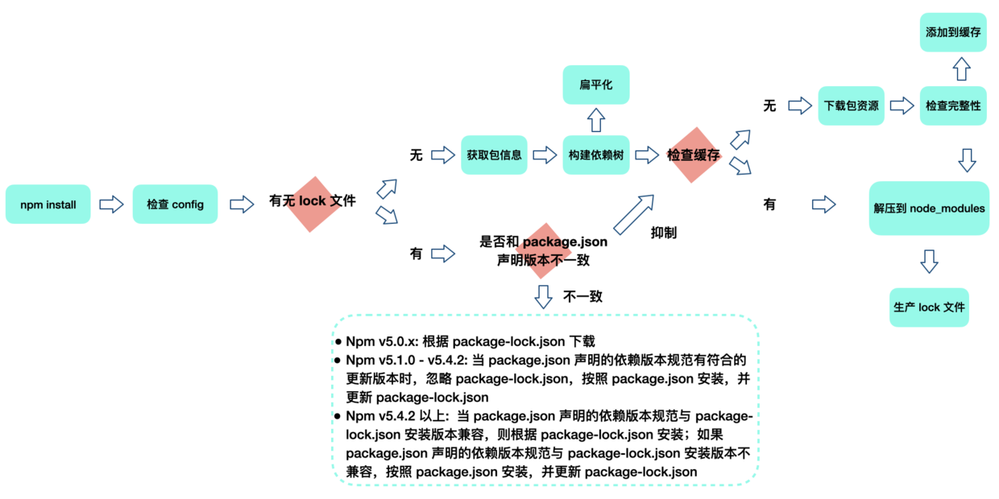

## `package.json`
```bash
# 配置默认项
npm set init.author.email "niuhao95@gmail.com"
npm set init.author.name "niuhao95"
npm set init.author.url "https://github.com/hao951029"
npm set init.license "MIT"
# 默认生成方式1
npm init -y

# 默认生成方式2
npm config set init-module ~\.npm-init.js
# .npm-init.js
const desc = prompt('请输入项目描述', '项目描述...')
module.exports = {
    key: 'value',
    name: prompt('name?', process.cwd().split('/').pop()),
    version: prompt('version?', '0.0.1'),
    description: desc,
    main: 'index.js',
    repository: prompt('github repository url', '', function(url) {
        if (url) {
            run('touch README.md');
            run('git init');
            run('git add README.md');
            run('git commit -m "first commit"');
            run(`git remote add origin ${url}`);
            run('git push -u origin master');
        }
        return url;
    })
}
```

### `name`
`scope` e.g. `@myorg/mypackage`

### `version`
[`semver - semantic versioning`](https://docs.npmjs.com/about-semantic-versioning)  
[`npm semver calculator`](https://semver.npmjs.com/)

### `main`

### `files`

### `scripts`
```json
{
  // npm run <stage>
  "scripts": {
    // Pre & Post scripts
    "precompress": "{{ executes BEFORE the `compress` script }}",
    "compress": "{{ run command to compress files }}",
    "postcompress": "{{ executes AFTER `compress` script }}",
    // Life Cycle Scripts
    "prepare": "",
    "prepublish": "", // 已弃用
    "prepublishOnly": "",
    "prepack": "",
    "postpack": ""
  }
}
```

### vs `package-lock.json`

#### `lockfileVersion`
todo

#### `hasInstallScript`
todo

## `npm`

### `npm install`
如果你的包根目录有[`binding.gyp`](http://nodejs.cn/api/addons/building.html)文件，并且没有定义自己的`install`或`preinstall`脚本，`npm`将通过`node-gyp rebuild`使用`node-gyp`进行编译默认的`install`命令。
```bash
npm install <pkg-name>

# preinstall
# install
# postinstall
# prepublish 已废弃
# preprepare
# prepare
# postprepare
```


#### 检查config文件`.npmrc`
项目下的 -> 用户级的 -> 全局的 -> 内置默认的

#### 构建依赖树
下载依赖按照扁平化原则优先下载到`node_modules`根目录，遇到相同模块就判断已存在的模块是否符合新模块的版本范围，符合跳过，不符合就添加到当前模块的`node_modules`目录

#### 缓存机制
- `npm config get cache` e.g.`:/Users/<user>/.npm`（Mac OS中npm默认的缓存位置）
- 通过`pacote`把相应的包解压到`node_modules`，`pacote`通过`npm-registry-fetch`下载包，`npm-registry-fetch`通过设置`cache`属性在给定的路径下根据`IETF RFC 7234`生成缓存数据
- `npm v5`之前，缓存直接存储在`~/.npm/cache/<name>/<version>`
- `npm v5`之后，缓存放在`.npm/_cacache`文件夹中，命令 `npm cache clean --force` 可以清除其中的文件
    - `content-v2` 包含一些二进制文件，将后缀修改为`.tgz`解压后就是对于的Npm包资源
    - `index-v5` 存储`content-v2`资源的索引，`package-lock.json`中的`integrity/version/name`可以生成唯一的对应这个索引的`Key`->`hash`->`tar包`->`pacote解压`
    - `tmp`
    - `node-sass`

#### `npm install --force` & `npm install --legacy-peer-deps`
[依赖冲突问题解决方案](https://stackoverflow.com/questions/66020820/npm-when-to-use-force-and-legacy-peer-deps)  
[npm new token](https://docs.npmjs.com/creating-and-viewing-access-tokens)  
[node-sass问题1](https://stackoverflow.com/questions/66239691/what-does-npm-install-legacy-peer-deps-do-exactly-when-is-it-recommended-wh)  
[node-sass问题2](https://stackoverflow.com/questions/45251645/error-enoent-no-such-file-or-directory-scandir)
```bash
node node_modules/node-sass/scripts/install.js
npm rebuild node-sass
```

### `npm ci`
[`npm ci`](https://www.npmjs.cn/cli/ci/)类似于 `npm install` ，不同之处在于它旨在用于自动化环境，例如测试平台、持续集成和部署 —— 或者您希望确保对依赖项进行全新安装的任何情况。通过跳过某些面向用户的功能，它可以比常规的 npm 安装快得多。它也比常规安装更严格，可以帮助捕获由大多数 npm 用户增量安装的本地环境引起的错误或不一致。

### `npm publish`
```bash
# 登录
npm login
npm whoami
# 发布
npm publish
# 更新
npm version patch/minor/major
npm publish

# prepublishOnly
# prepack
# prepare
# postpack
# publish
# postpublish
```

### `nrm`
用来管理多个 `npm` 源，方便切换
```bash
# 全局安装
npm i -g nrm

# 添加自定义源
nrm add jd http://registry.m.jd.com
# 切换当前使用的Npm源
nrm use jd
# 其他命令
nrm ls
nrm current
nrm del jd
# 测试延迟时间
nrm test jd
```

## `pnpm`
软链

## `yarn`

## `npm`/`pnpm`/`yarn` `node_modules`

## `npx`
在`npm v5.2`引入，在执行模块时会优先安装依赖，运行完成后会删除。

## `cross-env`
安装：`npm install --save-dev cross-env`
```json
{
  "scripts": {
    "dev": "cross-env NODE_ENV=development ...",
    "build": "cross-env NODE_ENV=production ..."
  }
}
```